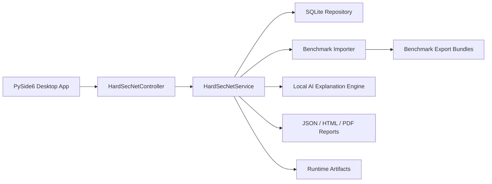

# HardSecNet PySide Architecture Guide

Date: 2026-04-22
Scope: local-first CIS hardening studio for the current device

## System Shape

HardSecNet runs as one local desktop application. The operator uses the PySide UI to inspect benchmark content, run local profiles, review findings, compare drift, inspect AI explanations, and export reports.

## Core Components

### Desktop UI

The UI lives in `src/hardsecnet_pyside/ui/`.

It exposes seven local sections:

- Dashboard
- Hardening
- Network
- AI Advisor
- Reports
- Benchmarks
- Settings

### Controller

`src/hardsecnet_pyside/app.py` owns the desktop controller facade. It delegates benchmark, run, report, comparison, approval, and AI operations to the service layer.

### Service Layer

`src/hardsecnet_pyside/services.py` owns the local workflow:

- bootstrap runtime folders and SQLite state
- load benchmark exports
- run selected profiles for the current device
- generate findings and comparison deltas
- create report artifacts
- create deterministic local AI explanation records

### Persistence

`src/hardsecnet_pyside/persistence.py` stores local records in SQLite:

- current device
- benchmark documents and items
- profiles
- runs
- findings
- comparisons
- reports
- approvals
- AI tasks
- settings

### Benchmark Import

`src/hardsecnet_pyside/benchmark.py` imports benchmark files, extracts controls, generates reviewable script candidates, and writes durable export bundles.

### Local AI

`src/hardsecnet_pyside/agents.py` provides the AI explanation surface. The settings are Ollama-oriented and local by default. The current implementation records deterministic local explanations; live Ollama calls remain an implementation improvement inside the same local-only boundary.

## Runtime State

Runtime data is under `runtime/`:

- `hardsecnet.db`
- `artifacts/`
- `reports/`
- `imports/`
- `generated_scripts/`
- `logs/`

Benchmark export bundles are committed under `src/hardsecnet_pyside/data/benchmark_exports/` so the app does not depend on the original PDFs at runtime for the seeded Windows and Ubuntu CIS content.

## Excluded Surfaces

This project does not include a remote control plane, child-device agent, fleet dashboard, remote job queue, campaign management, or multi-device orchestration. Those surfaces were removed from the codebase to keep the final project aligned to the local software scope.
