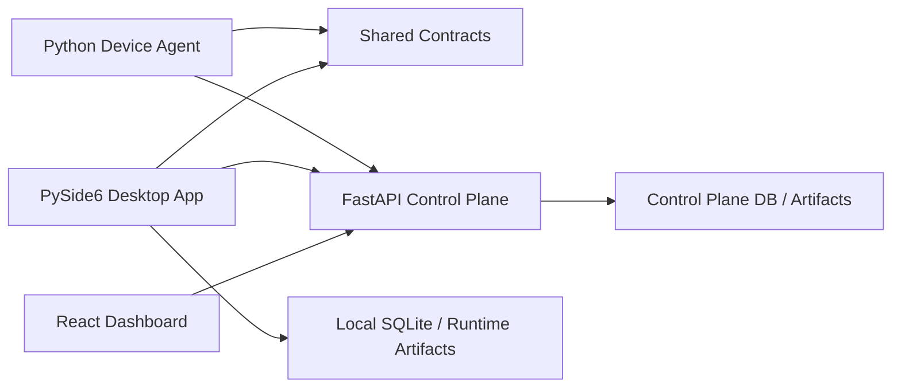

# Architecture Guide

## High-Level Shape

HardSecNet is a monorepo with four runtime surfaces and one shared contract layer.

## Desktop App

Location:

- [src/hardsecnet_pyside](/E:/T/hardsecnet/hardsecnet-pyside/src/hardsecnet_pyside)

Primary role:

- local operator workflows
- benchmark import
- local run/report generation
- advanced inspection
- optional fleet-backed mode when the control plane is configured

Important files:

- [app.py](/E:/T/hardsecnet/hardsecnet-pyside/src/hardsecnet_pyside/app.py)
- [services.py](/E:/T/hardsecnet/hardsecnet-pyside/src/hardsecnet_pyside/services.py)
- [benchmark.py](/E:/T/hardsecnet/hardsecnet-pyside/src/hardsecnet_pyside/benchmark.py)
- [persistence.py](/E:/T/hardsecnet/hardsecnet-pyside/src/hardsecnet_pyside/persistence.py)

## Control Plane

Location:

- [services/control_plane/app](/E:/T/hardsecnet/hardsecnet-pyside/services/control_plane/app)

Primary role:

- auth
- device registry
- job queue
- result/report ingestion
- fleet summary
- campaign state

Important files:

- [main.py](/E:/T/hardsecnet/hardsecnet-pyside/services/control_plane/app/main.py)
- [db_models.py](/E:/T/hardsecnet/hardsecnet-pyside/services/control_plane/app/db_models.py)
- [security.py](/E:/T/hardsecnet/hardsecnet-pyside/services/control_plane/app/security.py)

## Device Agent

Location:

- [services/device_agent/hardsecnet_device_agent](/E:/T/hardsecnet/hardsecnet-pyside/services/device_agent/hardsecnet_device_agent)

Primary role:

- enroll to control plane
- heartbeat
- poll approved jobs
- execute local adapters
- upload results

Important files:

- [main.py](/E:/T/hardsecnet/hardsecnet-pyside/services/device_agent/hardsecnet_device_agent/main.py)
- [client.py](/E:/T/hardsecnet/hardsecnet-pyside/services/device_agent/hardsecnet_device_agent/client.py)
- [windows.py](/E:/T/hardsecnet/hardsecnet-pyside/services/device_agent/hardsecnet_device_agent/adapters/windows.py)
- [linux.py](/E:/T/hardsecnet/hardsecnet-pyside/services/device_agent/hardsecnet_device_agent/adapters/linux.py)

## Dashboard

Location:

- [web/dashboard](/E:/T/hardsecnet/hardsecnet-pyside/web/dashboard)

Primary role:

- browser fleet overview
- devices/jobs/campaigns/reports visibility

Important files:

- [App.jsx](/E:/T/hardsecnet/hardsecnet-pyside/web/dashboard/src/App.jsx)
- [api.js](/E:/T/hardsecnet/hardsecnet-pyside/web/dashboard/src/api.js)

## Shared Contracts

Location:

- [shared/contracts/models.py](/E:/T/hardsecnet/hardsecnet-pyside/shared/contracts/models.py)

Why it exists:

- avoid ad hoc payload drift between desktop, backend, and agent
- keep device/job/report types consistent

## Data Flow

### Benchmark flow

1. import a benchmark source
2. parse controls into normalized items
3. store benchmark document and items
4. generate candidate profiles
5. export durable benchmark bundles into the repo
6. generate script candidates

### Fleet flow

1. backend bootstraps admin
2. device agent enrolls
3. device heartbeats are recorded
4. operator creates a job
5. agent claims and executes it
6. result and report are uploaded
7. dashboard and desktop read the new state

## Current Architectural Limits

- control-plane dev path is still SQLite-first
- dashboard is read-heavy and simple
- agent transport is polling, not realtime push
- generated CIS scripts are not uniformly production-validated

That is the current state. Not ideal, but clear.
