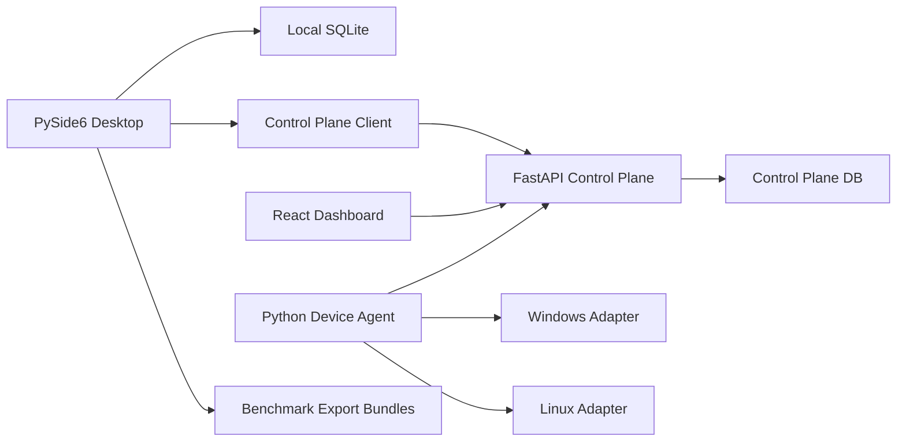
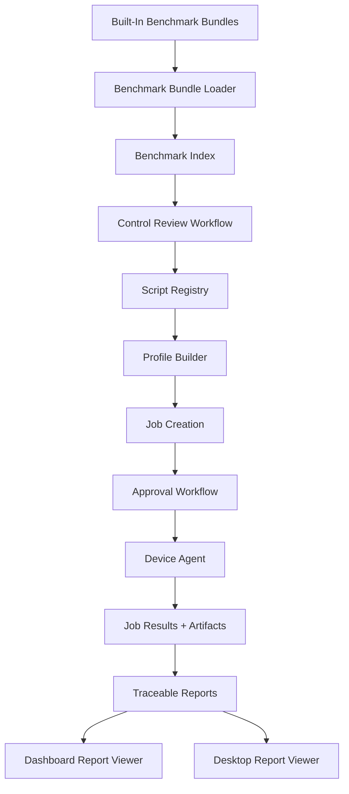

# HardSecNet Remaining Architecture

## 1. Architecture Goal

The next architecture target is to turn HardSecNet from a working platform slice into an operator-grade product.

Core principle:

> Benchmark controls, script validation state, jobs, approvals, execution results, and reports must be connected by explicit data contracts.

No more loose candidate files with no product lifecycle.

## 2. Current System



## 3. Target System



## 4. Key Architectural Decisions

### ADR-001: Exported CIS Bundles Become Built-In Sources

Decision:

- Load exported bundles from `src/hardsecnet_pyside/data/benchmark_exports/`.

Reason:

- The app should not depend on the original PDFs at runtime.
- Repo-owned JSON is easier to test, diff, and review.

Consequence:

- We need a bundle loader and duplicate detection.

### ADR-002: Script Candidate State Must Be Explicit

Decision:

- Add lifecycle state for generated scripts.

States:

- `candidate`
- `reviewed`
- `validated`
- `rejected`
- `deprecated`

Reason:

- Generated scripts are not safe enough to execute blindly.

Consequence:

- Job creation must check script state before hardening.

### ADR-003: Benchmark Browser Starts In Desktop

Decision:

- Add the first benchmark/control browser in the PySide desktop app.

Reason:

- Desktop already owns benchmark import/review workflows.
- Dashboard should eventually show benchmark versions, but desktop is better for deep review.

Consequence:

- Dashboard can consume benchmark/profile APIs later.

### ADR-004: Dashboard Owns Fleet Operations

Decision:

- Dashboard becomes the primary surface for fleet jobs, approvals, and reports.

Reason:

- Fleet operation is naturally browser-based and multi-device.

Consequence:

- Dashboard needs login, job creation, approvals, and detail screens.

### ADR-005: Agent Uses Polling For Now

Decision:

- Keep HTTP polling.

Reason:

- Simpler and reliable enough for early fleet work.

Consequence:

- Realtime dashboard will use refresh/polling first, not websockets.

## 5. New Components

### 5.1 Benchmark Bundle Loader

Location:

- `src/hardsecnet_pyside/benchmark.py` or new `src/hardsecnet_pyside/benchmark_loader.py`

Responsibilities:

- discover bundle directories
- parse `benchmark_document.json`
- parse `benchmark_items.json`
- validate bundle shape
- upsert into local repository
- preserve `export_script_dir`

### 5.2 Script Registry

Location:

- local repository first
- optionally repo-side metadata later

Responsibilities:

- store script path
- store lifecycle state
- store reviewer
- store validation notes
- store rollback readiness

Proposed model:

```python
ScriptRecord(
    id: str,
    benchmark_id: str,
    os_family: str,
    script_path: str,
    script_type: str,
    state: str,
    reviewed_by: str,
    validated_at: str,
    notes: str,
)
```

### 5.3 Benchmark Browser View

Location:

- `src/hardsecnet_pyside/ui/`

Responsibilities:

- list documents
- list controls
- filter/search
- show detail panel
- show script candidate
- show review controls

### 5.4 Dashboard Auth And Operator Screens

Location:

- `web/dashboard/src/`

Screens:

- login
- fleet overview
- device detail
- job creation
- approvals
- reports
- benchmark/profile versions

### 5.5 Agent Runtime Loop

Location:

- `services/device_agent/hardsecnet_device_agent/main.py`

Responsibilities:

- loop mode
- interval config
- retry policy
- offline queue
- graceful shutdown

## 6. Data Model Changes

### Local Desktop Repository

Add tables:

- `benchmark_bundle_imports`
- `script_records`
- `control_reviews`

### Control Plane

Add or extend tables:

- `approvals`
- `artifacts`
- `audit_logs`
- `benchmark_versions`
- `profile_versions`

### Shared Contracts

Add:

- `ScriptRecordModel`
- `ApprovalDecisionRequest`
- `ReportArtifactModel`
- `BenchmarkControlModel`
- `ControlReviewModel`

## 7. API Changes

### Dashboard Required APIs

- `POST /api/v1/auth/login`
- `GET /api/v1/devices`
- `GET /api/v1/devices/{device_id}`
- `POST /api/v1/jobs`
- `POST /api/v1/jobs/{job_id}/approve`
- `POST /api/v1/jobs/{job_id}/cancel`
- `GET /api/v1/reports/{report_id}`
- `GET /api/v1/reports/{report_id}/download/{format}`
- `GET /api/v1/artifacts/{artifact_id}`
- `GET /api/v1/audit-logs`

### Benchmark/Profile APIs Later

- `GET /api/v1/benchmark-versions`
- `GET /api/v1/benchmark-versions/{id}/controls`
- `GET /api/v1/profile-versions`
- `POST /api/v1/profile-versions`

## 8. Safety Rules

- candidate scripts cannot be used for hardening jobs
- hardening jobs require human approval
- rollback notes are mandatory for validated scripts
- every execution result must include artifact references
- every report must include benchmark provenance

## 9. Testing Strategy

### Unit Tests

- bundle loader
- script registry state transitions
- CIS control parsing
- profile mapping

### API Tests

- RBAC negative cases
- approval flow
- artifact/report download
- device detail

### UI Tests

- dashboard login
- job creation
- approval list
- benchmark browser smoke

### Integration Tests

- backend + agent poll loop
- audit job execution
- result upload
- report download

## 10. Implementation Sequence

1. built-in bundle loader
2. script registry
3. benchmark browser
4. dashboard login
5. dashboard device/job/report screens
6. agent loop mode
7. validated script batches
8. report/artifact download
9. production packaging

## 11. BMAD Checkpoint

- Role: `architect`
- Phase: `solutioning`
- Workflow: `bmad-create-architecture`
- Artifact created: `docs/bmad/architecture.md`
- Blockers:
  - `_bmad/bmm/config.yaml` missing
  - current generated scripts are not all validated
- Decisions:
  - make benchmark bundles first-class built-in data
  - introduce explicit script lifecycle
  - dashboard owns fleet operations
  - desktop owns deep benchmark review first
- Handoff target: `dev`
- Completion state: `drafted`
