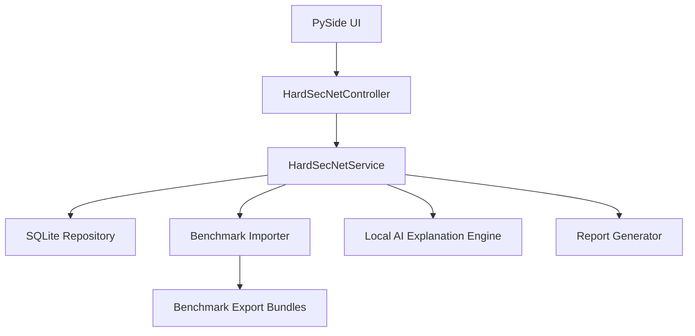

# Architecture

## Current Architecture

HardSecNet PySide is a single-process desktop application with local persistence and local artifacts.

## Modules

- `app.py`: desktop entry point and controller facade.
- `ui/`: seven local pages for dashboard, hardening, network posture, AI advisor, reports, benchmarks, and settings.
- `services.py`: local application workflow and report generation.
- `persistence.py`: SQLite-backed local repository.
- `benchmark.py`: benchmark import/export and script candidate generation.
- `agents.py`: local explanation, recommendation, and approval-note scaffolding.
- `config.py`: local runtime paths and Ollama-oriented AI settings.
- `models.py`: local domain dataclasses.

## Data Stores

- `runtime/hardsecnet.db`: local SQLite state.
- `runtime/artifacts/`: run artifacts.
- `runtime/reports/`: exported JSON, HTML, and PDF reports.
- `runtime/imports/`: imported source files.
- `runtime/generated_scripts/`: generated script candidates.
- `src/hardsecnet_pyside/data/benchmark_exports/`: durable committed benchmark bundles.

## Architectural Decisions

### ADR-001: Local-Only Boundary

The final project has no server-side control plane. All workflows execute through the desktop app and local repository.

### ADR-002: Review-Gated Scripts

Generated scripts are traceable candidates. They must be reviewed before production use.

### ADR-003: Deterministic AI Scaffolding Before Live Ollama

AI explanation records are local and deterministic today. Live Ollama integration can be implemented inside `agents.py` without changing the product boundary.

### ADR-004: Drift Is Local Run Comparison

Drift comparison means comparing previous and current run findings for the current device.

### ADR-005: Dashboard-First Desktop UX

The app opens on a local dashboard that summarizes benchmark controls, local runs, review items, drift deltas, AI tasks, and reports before the user drills into detailed pages.

### ADR-006: Removed Remote Surfaces

Remote control-plane, child-agent, shared contract, web-dashboard, campaign, and job-queue code has been removed to keep the implementation aligned with the final project scope.

## Validation Path

- Compile `src` and `tests`.
- Run `pytest -q tests`.
- Confirm source scans do not show remaining remote/fleet implementation references.
